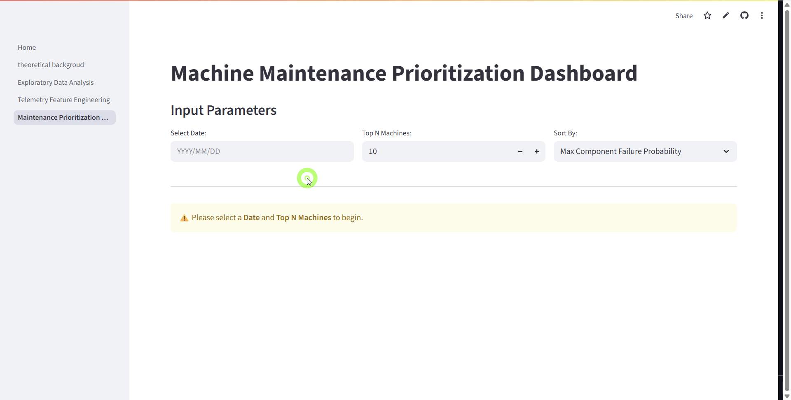

# Predictive Maintenance App

## Overview
This project demonstrates how **Survival Regression** can be applied to predictive maintenance on a fleet of machines using real telemetry data. Instead of relying on black box deep learning approaches, I used the **Cox Proportional Hazards Model with time-varying covariates** (via the [lifelines](https://lifelines.readthedocs.io/) package) to estimate machine component failure probability 2 days ahead.

The dataset comes from the **Microsoft Azure Predictive Maintenance** sample, which includes telemetry, error logs, and maintenance records for a fleet of machines. The model predicts **failure probabilities** for individual components, allowing maintenance teams to **prioritize inspections and repairs** in a data driven way.

The Streamlit app provides:
- A **ranked list of machines/components** at highest risk of failure.
- Interactive **visualizations** for failure probabilities and machine health.
- A **drill down view** for individual components and historical context.

### 🔗 Explore:
- [Kaggle Notebook](https://www.kaggle.com/code/eigenvalue42/predictive-maintenance-a-statistical-approach) – Full modeling workflow, theory and feature engineering.
- [Live Streamlit App](https://atki2828-predictive-maintenance-apphome-h6bwxx.streamlit.app/) – Interactive dashboard for exploring predictions.

---

## Structure
- **app/**  
  - **Home.py**: Main Streamlit app entry point.  
  - **pages/**: Additional Streamlit pages.  
  - **utils/**: Utility functions for UI components.  
  - **data/**: (Optional) Placeholder for raw/sample datasets (not included in repo).  
  - **static_plots/**: Pre-generated charts for faster dashboard rendering.  
- **pmhelpers/**  
  - **dataprocessing.py**: Data loading and feature engineering.  
  - **plots.py**: Visualization helpers (Plotly).  
  - **modeling.py**: Model training and prediction utilities.  
- **good_demo.gif**: Animated demo for this README.  
- **README.md**: Project documentation.  
- **pyproject.toml**: Project configuration and dependencies (managed with `uv`).  
- **uv.lock**: Lockfile for reproducible environments.  